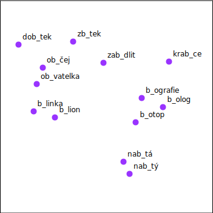
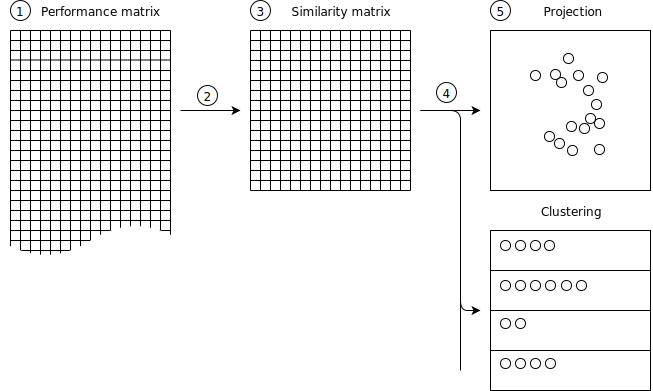
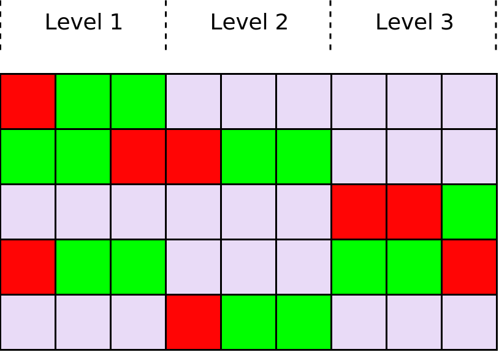
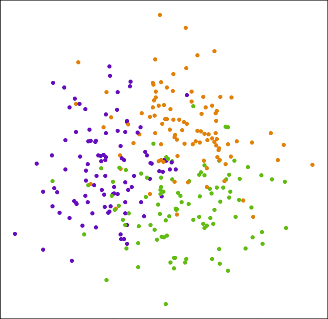

# Missing data and similarity

Tutoring systems are computer systems which purpose is to teach its users (students) some knowledge or skill. The key part of learning is solving items. I was working with dataset from tutoring system Umíme česky that provides thousands of such items. For management of the items, I wanted to display them in some way that can be naturally interpreted. Following text describes one way of doing so.

## Projection of items

Each dot in the image represents one item, and its proximity to others represents how similar they are. E.g., item "b\_ografie" is quite similar to "b\_olog", but it is not similar to "zb\_tek".

For this I choose to utilize correctness of answers from users. Items are similar when they are answered similarly by users. In other words, when two items require from users same skill they answers will be similar. But I want to know if similarity of items can also be affected by structure of system.

## Similarity pipeline

Now I want to describe how to produce such projection that similar items are close to each other. Numbers in image correspond to stages of pipeline:

1. At the start we have matrix (performance matrix) where each column corresponds to item and each row to user. Each corresponding position in matrix contains information about correctness of answer from use to a specific item. It contains value 1 in case of the correct answer and 0 for incorrect.
2. This step is used to compute the similarity between all pairs of items. In other words, I transform performance matrix into similarity matrix. I use Pearson correlation coefficient for this.
3. Similarity matrix is square containing similarity of all pairs of items It is symmetric, and all values at main diagonal are~$1.0$ (because each item is identical with itself).
4. Dimensionality reduction is used to transform similarity matrix into a projection. I use Principal component analysis (PCA) to generate 2D visualization of similarities.
5. Projection is more compact representation of similarity matrix used for visualizations for end users.

## Pattern of missing data

I did not mention this so far. BUt it is apparent that not all users answer all items. On the cotrary perforamnce matrix is relatively sparse. However, missing values are not distributed randomly, but they form a pattern.

Our question is whether this pattern of missing values can affect similarity of items and projections.

% structure of performance matrix

Items in each topic of the system are divided into up to three levels. The difficulty of the levels differs. That is why users in the system usually do not solve all of the available levels. Less experienced users tend to solve only first or first two levels. But, more experienced users solve only higher levels.

This pattern is also shown in following diagram. Green corresponds to correct answer, red to incorrect and gray is missing answer.

## Simulation

Once again, we use simulation to verify whether this factor can cause such regularity. This simulation is also constructed similarly as one we explained before in section~\ref{simulated-data}. The only difference is that resulting performance matrix will now contain missing values. We achieve this by requiring simulated users to solve only some items. Each user starts with solving one level and then with some probability continues to another. So most users solve only one level, some users solve two levels, and only a few users solve all three levels. Order in which they answer levels is chosen at random as users are not required to continue chronologically.

## Conclusion

This image shows resulting projection of simulated data with missing answers. Colors of items show which level they belong to (purple - first, yellow - second, and green - third). Simulated items all require same skill so formation of clusters means that missing values affect similarity of items.

## Continue reading

I focused on this topic in my [bachelor's thesis](http://ienze.me/tmsei_thesis/) and I found that more such factors exists. If you are interested you can continue reading about them there.
