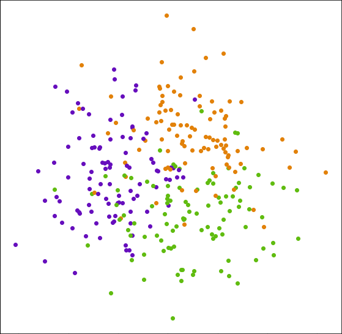

# Missing data and similarity

## useful projection

tutoring system, items, projection

This work focuses on tutoring system \umimeCesky{} that has thousands of items. For management of the items, we want to display them in some way that can be naturally interpreted. Figure~\ref{fig:sample_projection} shows such image. Each dot in the image represents one item, and its proximity to others represents how similar they are. E.g., item "b\_ografie" is quite similar to "b\_olog", but it is not similar to "zb\_tek".

However, there some unexplained regularities that can appear. They are causing separation of items into clusters which we want to get rid of or at least understand why they are formed.

## Similarity pipeline

## Pattern of missing data

## Simulation

## Conclusion

## Continue reading

More such factors exists, I described some of them in my [bachelor's thesis](http://ienze.me/tmsei_thesis/).
